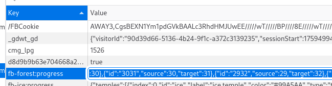

# 🗃️ Browser Storage Methods

Your web browser (e.g. Google Chrome, Firefox, Brave) will store data for websites.
A common example is to indicate that you are logged in, a browser will store a
"cookie" that can be used to verify that you are the logged-in user.
More importantly for us is that your browser will store your *save file* for web
games as well!

Data is (usually) in one of three places:
 * **Cookies**
 * **Session Storage**
 * **Local Storage** (the most important one!)

Cookies are short bits of text that are *sent to servers*.
Every time you send a request to a server, cookies are sent with it.
This means they are pretty short, and contain the minimum information to
identify you.

Session Storage and Local Storage can be accessed by JavaScript code running on
a website.

Session Storage is wiped when you close your browser.
Some shopping websites might put the items in your cart in Session Storage.

Local Storage persists when you close your browser, so it has to be explicitly
deleted by a website (or a game!).
This makes it perfect for storing save files, which need to last when the
browser is closed.

## How to inspect your browser storage

 1. On most browsers, you can **right-click anywhere on the page**. This will
    bring up a menu to **click "Inspect"** or **"Inspect Element"**.

    

 2. **Click on the tab called "Storage".**

    

 3. **Click on the right entry on the right side.**
    Be careful that there may be several entries.
    The save file is probably in the entry that matches the page you are on.

    

 4. **Double click on the "value" box** to copy and edit the contents of the storage.

    

> [!QUESTION] Why does every website get its own storage?
> This is a very simple security mechanism that browsers implement.
> Without it, a website could steal your cookies or data for another website.
> For example, the website might steal your login cookie for your Roblox
> account, and then be able to log in as you!

That's it! Good luck finding your save files.

> [!TIP] Where can I learn more?
> Check out the [MDN documentation on client-side
> storage](https://developer.mozilla.org/en-US/docs/Learn_web_development/Extensions/Client-side_APIs/Client-side_storage)
> for a comprehensive description of these mechanisms.
> There are more mechanisms that we did not cover, and there are some security
> subtleties as well.
