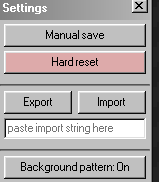

# 1.2: Using Import and Export

Some games make it super easy to locate a save file, as they want people to be able to use different saves. This will typically work by having a way to "Export" and "Import" the current save file.

To check for this, look in the settings of the game for an option that looks like:

Pressing the "export" button here will typically copy something to our clipboard, or download a file that we can use later with cyberchef.

To use a save file, try pressing the "import" option, which should prompt us to upload a file, or paste something into a box.