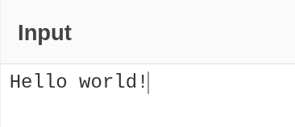
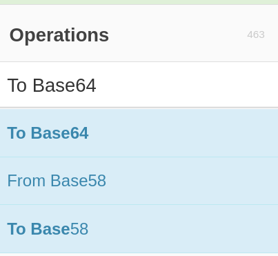
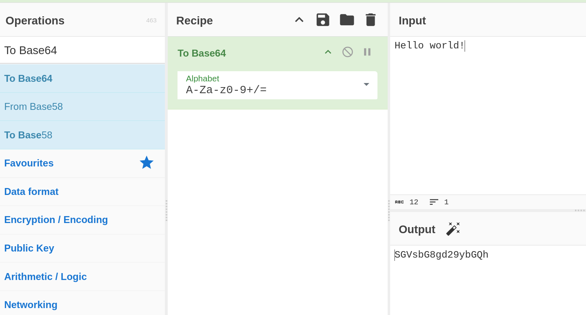

# Part 2.1: Using Cyberchef

Cyberchef (https://gchq.github.io/CyberChef/) is a great tool for simple decoding/encoding tasks.

It comes with a list of "Operations" we can combine into a "Recipe" to decode or encode text.

For example, to encode "Hello, world!" using Base64, we can:
1. Type our text into the "Input" box:

2. We can then use the search box on the left-hand side to find the "To Base64" operation.

3. We can then drag the operation into the "Recipe" section to make the recipe.

This will then run the recipe on our text, and we can see the encoded/decoded text in the "Output" section

