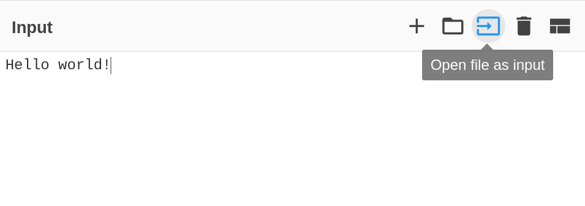

# Part 2.2: Decoding With CyberChef

When given a save file, if it is not in a readable format, we can try decoding with cyberchef!

1. To do this, first paste your save file into the input box.
 
> If your save file is a file on your computer, press "Open file as input":
> 
> Next, find the save file and double click it (or press open). This will place the file into input for you.

2. Now, we can guess the operation that will decode our text. Some typical encodings are "Base64" and "Zlib". "Decoding" operations typically have some word like "From" or "Inflate" in the operations.

> If you are struggling, you can try the "Magic" operation, which will give you a hint for what encoding may be used.

3. Repeat step 2, adding more operations to the recipe until we can read the text in the "Output" section!