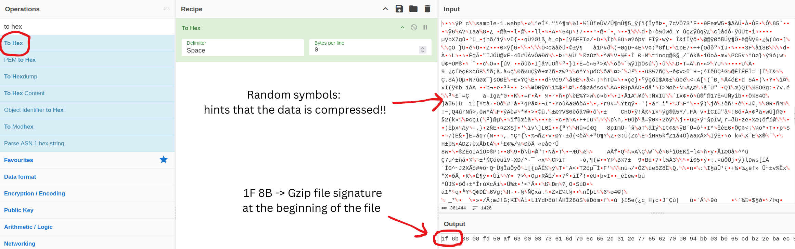
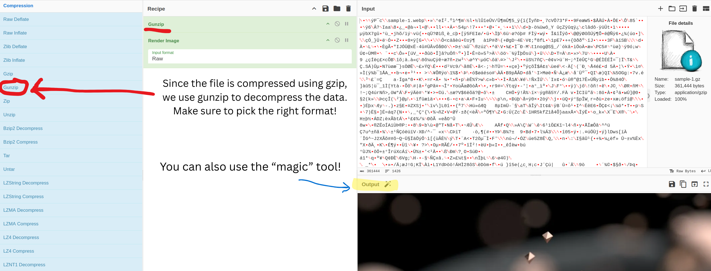

# Data Compression

## Why Compress Save Files?

Data compression is simply the process of shrinking a file to make it smaller. Game developers do this for a few reasons:

- **Saving Disk Space**: A smaller save file takes up less storage.
- **Faster Loading and Saving**: Smaller files can be read and written much faster, leading to quicker save and load times in the game.
- **Hiding Data**: Compressed data is not readable. This stops users from opening the save file in a text editor and easily changing the file content.

> 

## How to Identify Compressed Files

A computer needs a way to know what kind of file it's reading. It doesn't look at the file extension (like .zip). Instead, it reads the first few bytes of the file itself, called the header. The most important part of the header is `the first 2 to 4 bytes`, called the **File Signature (or Magic Number)**.

> [!INFO]
> You can find the signature by using the `To Hex` recipe in CyberChef and looking at the very first bytes in the output.

> [!TIP]
> If the data looks like a total mess of random symbols, that's a strong hint it might be compressed!

## Common Compression Formats

| Format Name | CyberChef Recipe (to decompress) | Signature (Magic Number)  | Description                                            |
|-------------|--------------------------------|---------------------------|--------------------------------------------------------|
| Raw Deflate | Raw Inflate                    | (none)                    | Compressed data with  **no** header or any extra info. |
| Zlib        | Zlib Inflate                   | `78 01`, `78 9C`, `78 DA` | Compressed data wrapped with a small Zlib header.      |
| Gzip        | Gunzip                         | `1F 8B`                   | Compressed data with a Gzip header.                    |
| Zip archive | Unzip                          | `50 4B 03 04`             | An archive designed to hold one or more files.         |

> [!IMPORTANT]
> `Raw Deflate` is just the pure compressed data itself, with no magic numbers. This is the compression used in the Clicker Heroes' save file.

## Guide

> [!NOTE]
> Here is the process you will need to follow when you find a compressed save file:
> 1. Use the `To Hex` recipe in CyberChef to find the File Signature (magic number) at the start of the data.
> 
> 2. Look up the **signature** in the Cheat Sheet above to find the correct CyberChef recipe.
> 
> 3. Inspect the output: After decompressing, **the data should now be readable** (like JSON or plain text).
> 4. Edit the file. Change the values to whatever you want!
> 5. **Encode it back**. You need to re-compress your edited data so the game can read it (see section `1.2.3: Encoding Save Files` for more information).
> 6. Load your new save file to see your changes! 🥳🎉🎉
